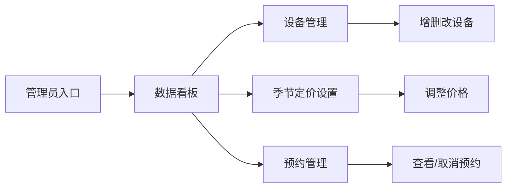

## 1. 产品概述
天文台预约系统是一个面向观星爱好者与观测台管理员的可视化预约平台。爱好者可通过平面图、日历预约观测点位和设备，管理员可在线管理设备状态与定价。

- **目标用户**：天文爱好者、观测台管理员
- **核心价值**：可视化预约流程、实时库存展示、智能化时段冲突检测
- **运行端口**：后端业务逻辑 8811，前端可视化页面 3811

## 2. 核心功能

### 2.1 用户角色
| 角色 | 登录方式 | 核心权限 |
|------|----------|----------|
| 观星爱好者 | 无需登录，填写信息预约 | 浏览平面图、查看天气日历、预约观测点位、预约设备 |
| 观测台管理员 | 管理员入口 | 设备管理、定价设置、数据看板、预约管理 |

### 2.2 功能模块
1. **爱好者首页**：天文台实景平面图、天气日历、点位预约、设备预约
2. **管理端首页**：数据看板（当日预约人数、空置观测位）、设备管理、季节定价设置

### 2.3 页面详情
| 页面名称 | 模块名称 | 功能描述 |
|---------|---------|----------|
| 爱好者首页 | 顶部导航 | 标题、角色切换（爱好者/管理员）、当前日期展示 |
| 爱好者首页 | 天文台平面图 | 分区展示望远镜观测点位、室内观景区，点击可选状态 |
| 爱好者首页 | 天气日历 | 日历视图展示每日天气适配度，可选择日期 |
| 爱好者首页 | 时段选择 | 展示当日可选时段，显示占用状态 |
| 爱好者首页 | 设备预约 | 分类展示设备库存，实时显示剩余数量 |
| 爱好者首页 | 预约表单 | 填写用户信息，提交预约 |
| 管理端首页 | 数据看板 | 当日预约人数、空置观测位、近期预约列表 |
| 管理端首页 | 设备管理 | 设备列表、增删改、状态切换 |
| 管理端首页 | 季节定价 | 四季价格设置、点位倍率 |
| 管理端首页 | 预约管理 | 预约列表、取消预约 |

## 3. 核心流程

### 爱好者预约流程
用户进入首页 → 查看平面图浏览观测点位 → 选择日期（日历）→ 选择时段 → 选择设备 → 填写信息 → 提交预约 → 预约成功

```mermaid
flowchart LR
    A["进入首页"] --> B["查看天文台平面图"]
    B --> C["选择日期（天气日历）"]
    C --> D["选择时段"]
    D --> E["选择观测点位"]
    E --> F["选择设备（可选）"]
    F --> G["填写预约信息"]
    G --> H{"时段冲突检测"]
    H -->|冲突| I["提示冲突，无法提交"]
    H -->|不冲突| J["提交预约"]
    J --> K["预约成功"]
```

### 管理员操作流程
管理员登录 → 查看数据看板 → 管理设备/设置定价 → 查看预约列表



## 4. 用户界面设计

### 4.1 设计风格
- **设计主题**：星空科技感，深色主题为主，搭配星空蓝与科技蓝
- **主色调**：深空蓝 (#0f172a 深蓝背景、#1e3a8a 星空蓝
- **辅助色**：#3b82f6 科技蓝、#fbbf24 星光金（优质天气）、#10b981 翡翠绿（可用状态）、#ef4444 赤红（占用/错误）
- **字体**：使用 'Orbitron（标题，科技感）、'Noto Sans SC'（正文）
- **按钮风格**：圆角矩形按钮，带微妙发光效果，hover时增强发光
- **布局风格**：卡片式布局，玻璃态背景，毛玻璃效果
- **图标风格**：线性图标，搭配发光效果

### 4.2 页面设计概览
| 页面名称 | 模块名称 | UI元素 |
|---------|---------|--------|
| 爱好者首页 | 平面图区域 | SVG交互式平面图、点位标记、状态颜色区分、Tooltip信息弹窗 |
| 爱好者首页 | 天气日历 | 日历网格、天气图标、适配度颜色标识 |
| 爱好者首页 | 设备列表 | 分类标签、库存进度条、增减按钮 |
| 爱好者首页 | 预约面板 | 分步引导、选中信息汇总、提交按钮 |
| 管理端首页 | 数据看板 | 统计卡片、数字动画、趋势指示 |
| 管理端首页 | 设备管理 | 表格列表、操作按钮、状态开关 |
| 管理端首页 | 季节定价 | 四季卡片、价格输入框、保存按钮 |

### 4.3 响应式
- 桌面端优先设计
- 平板端自适应布局
- 移动端单列布局优化

### 4.4 动效设计
- 页面加载时星空粒子动画背景
- 点位悬停发光放大效果
- 日历切换滑动过渡
- 数据数字滚动动画
- 模态框淡入淡出效果
