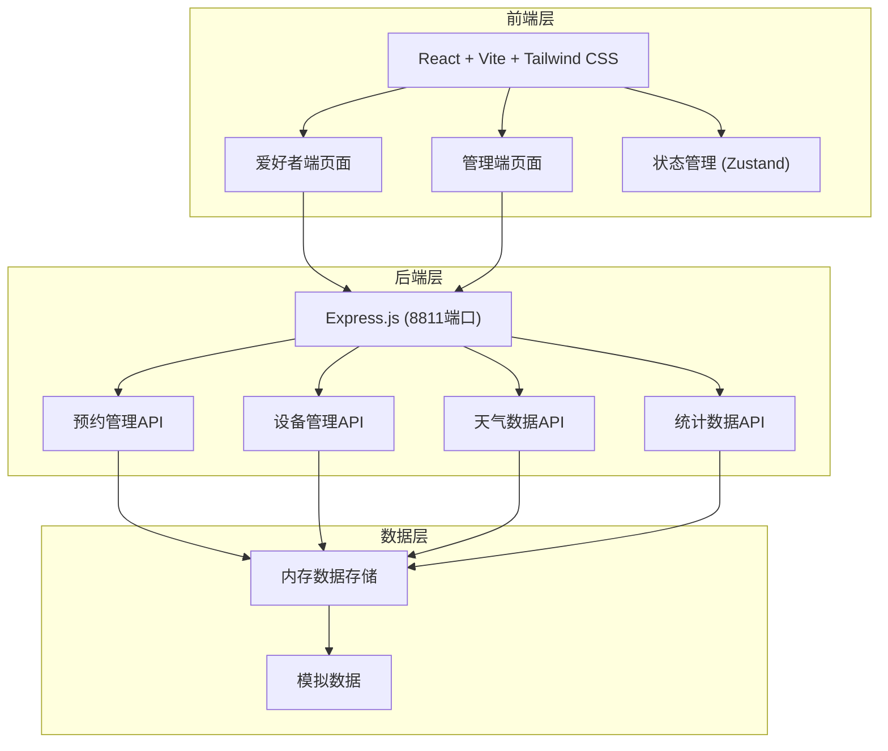
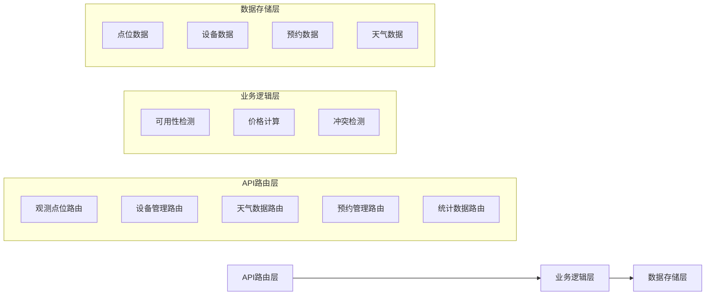
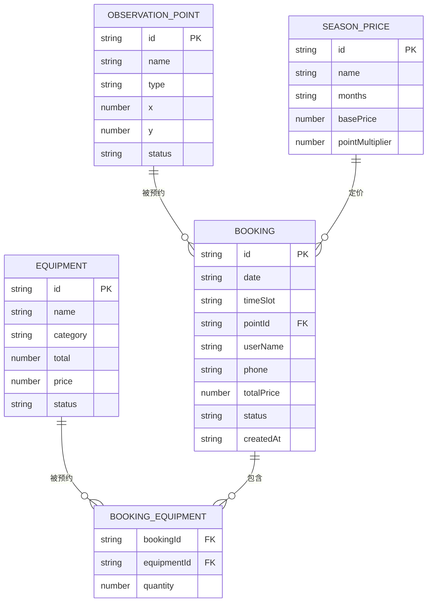

## 1. 架构设计



## 2. 技术描述

- **前端**：React@18 + TypeScript + Vite + Tailwind CSS
- **状态管理**：Zustand
- **路由**：React Router DOM
- **图标**：Lucide React
- **后端**：Express@4（独立运行在 8811 端口）
- **数据**：内存存储 + Mock 数据
- **前端开发服务器**：Vite (3811端口)

## 3. 路由定义

| 路由 | 用途 |
|------|------|
| / | 爱好者首页（预约系统） |
| /admin | 管理端首页（数据看板与管理） |

## 4. API 定义

### 4.1 观测点位

```typescript
interface ObservationPoint {
  id: string;
  name: string;
  type: 'telescope' | 'indoor';
  x: number;
  y: number;
  status: 'available' | 'maintenance';
  isBooked?: boolean;
  isAvailable?: boolean;
}

GET /api/observation-points
GET /api/observation-points?date=YYYY-MM-DD&timeSlot=HH:MM-HH:MM
PUT /api/observation-points/:id
```

### 4.2 设备管理

```typescript
interface Equipment {
  id: string;
  name: string;
  category: 'telescope' | 'filter' | 'binocular' | 'accessory';
  total: number;
  available?: number;
  price: number;
  status: 'active' | 'inactive';
}

GET /api/equipment
GET /api/equipment?date=YYYY-MM-DD&timeSlot=HH:MM-HH:MM
POST /api/equipment
PUT /api/equipment/:id
```

### 4.3 天气数据

```typescript
interface WeatherData {
  date: string;
  condition: string;
  visibility: string;
  suitability: 'excellent' | 'good' | 'fair' | 'poor';
  temperature: number;
  humidity: number;
  windSpeed: number;
}

GET /api/weather?date=YYYY-MM-DD
GET /api/weather/calendar?month=YYYY-MM
```

### 4.4 预约管理

```typescript
interface Booking {
  id: string;
  date: string;
  timeSlot: string;
  pointId: string;
  userName: string;
  phone: string;
  equipment: { id: string; quantity: number }[];
  totalPrice: number;
  status: 'confirmed' | 'cancelled';
  createdAt: string;
}

GET /api/bookings
GET /api/bookings/:id
POST /api/bookings
DELETE /api/bookings/:id
```

### 4.5 季节定价

```typescript
interface SeasonPrice {
  id: string;
  name: string;
  months: number[];
  basePrice: number;
  pointMultiplier: number;
}

GET /api/season-prices
PUT /api/season-prices/:id
```

### 4.6 统计数据

```typescript
interface DashboardStats {
  today: {
    date: string;
    bookingCount: number;
    vacantPoints: number;
    totalPoints: number;
  };
  overall: {
    totalBookings: number;
    totalRevenue: number;
    totalEquipment: number;
    totalPoints: number;
  };
  recentBookings: Booking[];
}

GET /api/stats/dashboard
```

### 4.7 价格计算

```typescript
GET /api/price/calculate?date=YYYY-MM-DD&pointId=xxx
```

## 5. 服务端架构图



## 6. 数据模型

### 6.1 数据模型关系



### 6.2 项目目录结构

```
frontend/
├── src/
│   ├── components/       # 可复用组件
│   │   ├── FloorMap/    # 平面图组件
│   │   ├── Calendar/    # 日历组件
│   │   ├── EquipmentList/ # 设备列表
│   │   └── ...
│   ├── pages/           # 页面组件
│   │   ├── Home.tsx     # 爱好者首页
│   │   └── Admin.tsx    # 管理端首页
│   ├── stores/          # Zustand状态管理
│   ├── services/        # API服务
│   ├── types/           # TypeScript类型定义
│   ├── utils/           # 工具函数
│   ├── App.tsx
│   └── main.tsx
├── package.json
├── vite.config.ts
└── tailwind.config.js
```
